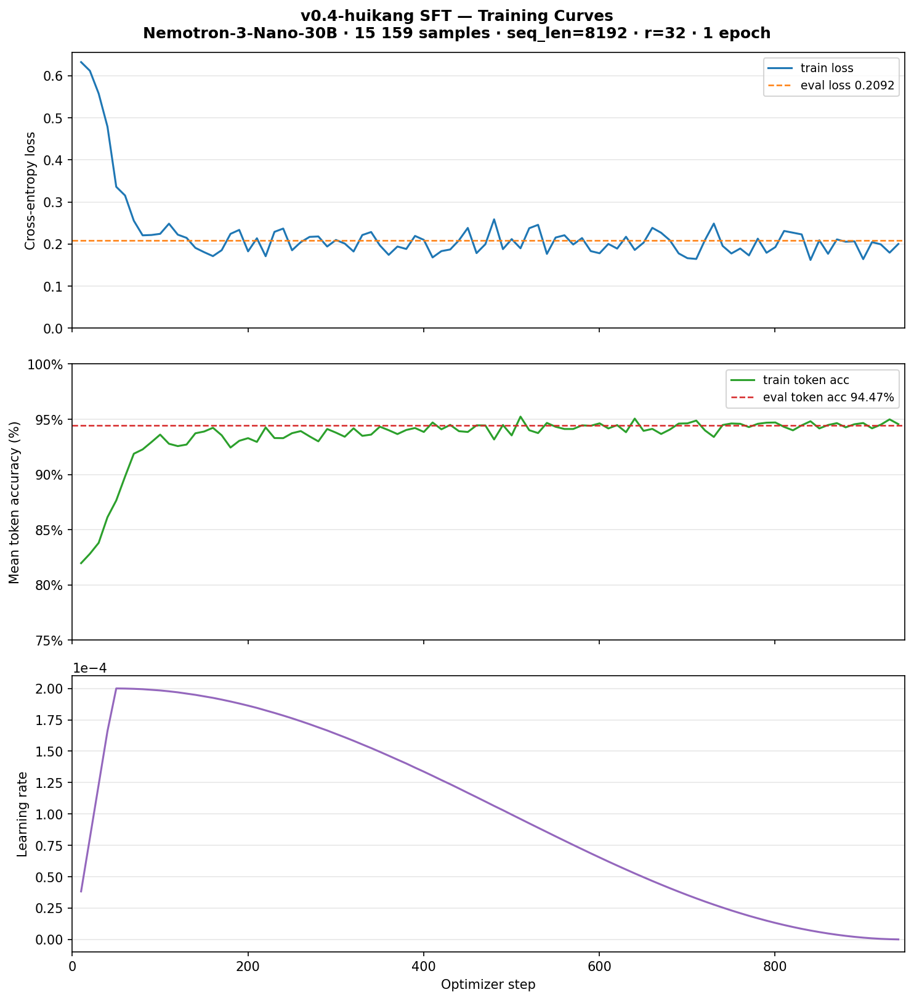

# Nemotron LoRA Training on GB10 for the Kaggle Reasoning Challenge

https://www.kaggle.com/competitions/nvidia-nemotron-model-reasoning-challenge

This repo contains the full pipeline for training a Nemotron LoRA adapter on a GB10-style NVIDIA system using Hugging Face, PEFT, TRL, and DSPy, then exporting a Kaggle-compatible `submission.zip`.

## Methodology

This project applies the **vibe planning** methodology to competitive ML — using Claude Code
as an active collaborator throughout research, debugging, and implementation rather than as a
code generator. The approach is demonstrated in
[msusol/vibe-planning-dgx-spark-demo](https://github.com/msusol/vibe-planning-dgx-spark-demo).

## Goal

The target competition is the **NVIDIA Nemotron Model Reasoning Challenge** on Kaggle. The required submission is a LoRA adapter for **Nemotron-3-Nano-30B** (rank ≤ 32) scored by answer accuracy across 14 problem categories.

### Evaluator constraints (from `metric/nvidia-nemotron-metric`)

The competition scores submissions using **vLLM**, not HuggingFace PEFT. Key constraints that
directly shape training decisions:

| Constraint | Value | Implication |
|---|---|---|
| `max_model_len` | **4096 tokens** (prompt + output) | Train on examples ≤ 4096 tokens only |
| `max_tokens` | **3584 tokens** (max output) | Thinking chain + `\boxed{answer}` must fit |
| `enable_thinking` | **True** | Chat template must use thinking mode during training |
| `temperature` | 1.0 | Score has ±0.01 variance between identical runs |
| `max_lora_rank` | 32 | Matches our LoRA config |
| Answer extraction | Last non-empty `\boxed{...}` in output | Training data must end with `\boxed{answer}` |

### Training data alignment check

`data/v0.9_train.jsonl` — 13,730 examples, 14 categories:

```
Token range    Count    Pct   Distribution
-----------  -------  -----  ----------------------------------------
      0–512    2,630  19.2%  ████████████████████
    512–1024   1,465  10.7%  ███████████
  1024–2048    5,216  38.0%  ████████████████████████████████████████
  2048–3072    2,993  21.8%  ██████████████████████
  3072–4096      854   6.2%  ██████
  ───────────── 4096-token evaluator budget ──────────────────────────
  4096–5120      282   2.1%  ██
  5120+          290   2.1%  █

Within budget: 13,158 / 13,730 (95.8%) · Median ~1,393 tok · p90 ~3,089 tok
```

100% of assistant responses end with a non-empty `\boxed{answer}`.  
Training `apply_chat_template` already uses `enable_thinking=True` — format-aligned with evaluator.

See [ADR-0006](docs/adr/0006-training-sequence-length-aligned-to-evaluator-budget.md) for full analysis.

## Hardware

Training runs on a **NVIDIA DGX Spark (GB10)** — 128 GB unified CPU/GPU memory, Blackwell GB10 GPU, aarch64.


## Training Strategy

Three regressions (v0.1=0.57 → v0.2=0.54 → v0.3=0.50) all traced to the same root cause:
the competition **test set has 14 problem categories**, but the training CSV only exposes 6.
Any model trained solely on `train.csv` data scores 0% on the 8 unseen test categories, which
together represent the majority of the evaluation set.

### v0.9 — Format 4 SFT two-run curriculum (current)

v0.9 is the active training track on GB10. It combines the huikang + kishanvavdara corpora
into **Format 4** (correct `<think>…</think>\boxed{}` structure) and uses a two-run
curriculum that mirrors the Kaggle notebook strategy:

| Run | `MAX_SEQ_LENGTH` | `MIN_SEQ_LENGTH` | Warmstart | Examples |
|-----|-----------------|-----------------|-----------|----------|
| run9 | 4096 | 0 | None (base model) | 7,966 (≤4096 tok) |
| run10 | 7680 | 4096 | run9 adapter | 13,394 (4096–7680 tok) |

**GB10 compatibility notes** (see `docs/investigate/v0.9-run8-oom-and-run9-fixes.md`):

- **Kaggle adapters cannot warmstart on GB10**: Adapters from the Kaggle RTX Pro 6000
  run (saved with `peft_version="0.18.1"`) are missing 92 of 232 expected Mamba SSM
  keys (`in_proj`/`out_proj` for all 23 layers). PEFT randomly initializes missing keys
  instead of raising an error, producing an inconsistent 883M-param adapter. Always start
  from the base model on GB10 for the first run of any new target-module set.

- **Gradient checkpointing workaround**: `NemotronHForCausalLM.supports_gradient_checkpointing=False`
  blocks the standard `gradient_checkpointing_enable()` path. Native GC is enabled via
  `NemotronHModel._set_gradient_checkpointing()` before training, then
  `model.gradient_checkpointing_enable` is replaced with a no-op so SFTTrainer doesn't
  re-raise the `ValueError`. Without GC, all 128 MoE expert activations live in CUDA
  memory simultaneously → OOM at step 0.

- **`padding_free` kwarg**: The Kaggle Unsloth build patches `SFTConfig` to accept
  `padding_free`; the DGX build does not. The kwarg must be absent; Unsloth on DGX
  auto-enables padding-free when supported.

Run9 status (2026-06-10): training at ~32 s/step, loss=0.75 at step 10, ~4.5h total.

See [`docs/plans/v0.9-plan.md`](docs/plans/v0.9-plan.md) for the full plan.

### v0.4 — SFT on the huikang corpus

The `samvalladares/huikang-nemotron-artifacts` public dataset contains 15,979 pre-tokenized
training examples covering **both the training set and the full test set**, including all 14
problem categories. The CoT traces are generated by **deterministic Python solvers** — not an
LLM — so every trace is correct by construction. The reference notebook using this corpus
scores **0.85** on the public leaderboard.

Key changes vs v0.1–v0.3:
- Dataset: 15,979 problems across 14 categories (was 2,510 across 6)
- `max_seq_length=8192` — exhaustive reasoning traces average 3,292 tokens (was 4096, truncating most traces)
- `target_modules` expanded to include attention layers (q/k/v/o) + lm_head (was Mamba only)
- `lr=2e-4` with one epoch — matches the validated huikang training config

Three v0.4 runs were needed to identify and fix the regression causes — see
[`docs/investigate/v0.4-kaggle-regression.md`](docs/investigate/v0.4-kaggle-regression.md)
for the full root cause analysis and fix history.

See [`docs/investigate/huikang-pipeline.md`](docs/investigate/huikang-pipeline.md) for a full
analysis of the corpus, the solver approach, and the Tinker training framework.

### v0.5 — GRPO self-improvement (target: >0.85)

After v0.4 SFT establishes the 0.85 baseline, **GRPO** (Group Relative Policy Optimization)
pushes beyond it. The model generates N=8 reasoning traces per problem, scores each by answer
correctness against ground truth, and updates via relative advantage — no external CoT needed.

The GB10's 121 GB unified memory handles GRPO at `max_new_tokens=6144, N=8` — larger than the
96 GB RTX Pro 6000 used by the reference notebook, giving room for higher-quality generation
per training step.

Key GRPO requirements already satisfied by our stack:
- `transformers==5.5.3` native Nemotron-H implementation fixes the KV cache name mismatch
  (`past_key_values` vs `cache_params`) that causes 20× slowdown without the fix [cite:145]
- No `trust_remote_code=True` — uses the fixed built-in implementation
- Gradient checkpointing via `NemotronHModel._set_gradient_checkpointing()` (native
  `GradientCheckpointingLayer` path); `gradient_checkpointing_enable()` is no-op'd on the
  instance because `supports_gradient_checkpointing=False` would raise `ValueError`

See [`docs/plans/v0.5-grpo-plan.md`](docs/plans/v0.5-grpo-plan.md) for the full plan.

## Repository layout

```text
.
├── .env                         # not tracked — HF_TOKEN, KAGGLE_API_TOKEN go here
├── .gitignore
├── CLAUDE.md
├── README.md
├── Dockerfile.gb10                      # primary build (26.05-py3)
├── Dockerfile.vllm-gb10                 # vLLM serving image — CoT generation + GRPO inference
├── .clinerules/                         # 18 rules (framework 01-12, project-specific 13-18)
├── configs/
│   └── nemotron.yaml                # training hyperparameters
├── data/
│   ├── train.csv            # competition training labels (9,500 problems, 6 categories) — committed
│   ├── test.csv             # competition test prompts (held-out) — committed
│   ├── v0.4_train.jsonl     # 15,159 examples — huikang corpus (gitignored; run run_extract_corpus.sh)
│   ├── v0.4_valid.jsonl     # 820 examples   — huikang corpus validation split (gitignored)
│   ├── v0.9_train.jsonl     # ~18,603 examples — Format 4, 14 categories (gitignored; run prepare_v09_data.py)
│   ├── v0.9_valid.jsonl     # ~979 examples  — v0.9 validation split (gitignored)
│   ├── nemo_train.jsonl     # 15,159 examples — NeMo-format (gitignored; or download from Kaggle)
│   ├── nemo_valid.jsonl     # 820 examples   — NeMo-format validation split (gitignored)
│   └── nemo_dataset/        # Kaggle dataset card (README.md + dataset-metadata.json — committed)
├── docs/
│   ├── images/
│   │   ├── dgx-spark-dashboard.png         # DGX Spark CPU/GPU usage during training
│   │   ├── training_comparison_v01_v02.png # v0.1 vs v0.2 training curves
│   │   ├── training_v03.png                # v0.3 training curves
│   │   └── training_v04.png                # v0.4 training curves (loss, token acc, LR)
│   ├── investigate/
│   │   ├── dataset-comparison.md           # raw competition data vs peer CoT dataset
│   │   ├── huikang-pipeline.md             # 0.85 corpus investigation — solvers, Tinker, test categories
│   │   ├── kuangyicheng-087-notebook.md    # 0.87 notebook analysis — Modal infra, format audit, cost
│   │   ├── kaggle-notebook-setup.md        # Kaggle env quirks — utility script, trust_remote_code
│   │   ├── v0.3-training-analysis.md       # v0.3 training metrics and analysis
│   │   ├── v0.4-training-analysis.md       # v0.4 runs comparison + LR schedule explanation
│   │   ├── v0.4-kaggle-regression.md       # root cause of 0.49/0.50 regression; Fix 1–4 status
│   │   ├── v0.4-oom-loading.md             # CUDA allocator cache OOM during model load
│   │   └── v0.4-oom-training.md            # activation memory OOM at seq_len=8192
│   └── plans/
│       ├── TODO.md                      # central task checklist
│       ├── leaderboard.md               # run history and scores
│       ├── leaderboard.md               # run history and scores
│       ├── TODO.md                      # central task checklist
│       ├── v0.3-cot-filtered-plan.md    # v0.3 plan (complete — Kaggle 0.50)
│       ├── v0.4-blended-plan.md         # v0.4 plan — huikang corpus SFT
│       ├── v0.4-nemo-framework-plan.md  # NeMo framework alternative training path
│       ├── v0.5-grpo-plan.md            # v0.5 GRPO plan — init from v0.4-r3 adapter
│       ├── v0.5-huikang-v26-adapter-plan.md  # v26 adapter analysis (superseded — all-linear incompatible)
│       ├── competition-overview.md
│       ├── CITATIONS.md
│       └── ...                          # submission-*, hybrid-mamba-*, archive/
├── notebook/
│   ├── v09_data_prep.ipynb              # v0.9 data prep — 14-category proof, before/after conversion, stats
│   ├── nemotron_v05_sft_unsloth.ipynb   # public prize eligibility writeup
│   ├── kernel-metadata.json                     # push config for prize notebook
│   ├── nemotron_submission_demo.ipynb           # submission path 2: load adapter → /kaggle/working
│   ├── submission-demo-kernel-metadata.json     # push config for submission demo
│   └── scrapbook.ipynb
├── start_jupyter.sh             # start JupyterLab in a tmux session (port 8888)
└── scripts/
    ├── build_image.sh               # builds Docker image (26.04 primary)
    ├── load_config.sh               # exports configs/nemotron.yaml as env vars
    ├── download_data.py             # competition data download + JSONL conversion
    ├── download_peer_cot.py         # peer CoT dataset download + JSONL conversion
    ├── smoke_test_nemotron.py
    ├── train_lora.py
    ├── infer_lora.py                # run inference with a saved adapter
    ├── validate_metric.py           # score predictions against labels
    ├── plot_training.py
    ├── package_submission.sh        # zip adapter into submission.zip
    ├── analyze_by_type.py           # per-type accuracy breakdown from scored predictions
    ├── blend_datasets.py            # blend versioned data files into a training set
    ├── generate_synthetic_cot.py    # call vLLM API to generate + verify CoT for gap problems
    ├── reconstruct_v0.1_data.py     # rebuild v0.1 JSONL from competition CSV cache
    ├── run_download.sh              # runner: competition data
    ├── run_download_peer_cot.sh     # runner: peer CoT dataset
    ├── run_smoke_test.sh
    ├── extract_huikang_corpus.py    # decode pre-tokenized huikang artifacts → v0.4 JSONL
    ├── convert_jsonl_to_nemo.py     # tokenize v0.4 JSONL → NeMo pre-tokenized SFT format
    ├── prepare_nemo_dataset.py      # NeMo dataset preparation (alternative path)
    ├── run_extract_corpus.sh        # runner: extract huikang corpus → data/v0.4_*.jsonl
    ├── run_convert_jsonl_to_nemo.sh # runner: tokenize → data/nemo_dataset/nemo_*.jsonl
    ├── run_train.sh                 # runner: training (reads configs/nemotron.yaml; tees log)
    ├── run_inference.sh             # runner: inference (tees log to output/inference_*.log)
    ├── run_validate.sh
    ├── run_vllm.sh                  # start vLLM OpenAI-compatible server (nemotron-vllm-gb10)
    ├── prepare_v09_data.py          # build data/v0.9_train.jsonl + v0.9_valid.jsonl (Format 4, 14 categories)
    ├── train_v9_sft.py              # v0.9 SFT from base model, max_seq_length=8192, 1000 steps
    ├── run_train_v9.sh              # Docker runner for v0.9 SFT
    └── services.sh                  # pause/resume non-training containers around a training run
```

## Commands

### 1. Build the image

```bash
bash scripts/build_image.sh
```

**GB10 / aarch64**: Always build directly on the GB10 — never import an image built on x86\_64.
The `causal_conv1d` and `mamba_ssm` CUDA extensions must be compiled for `aarch64 + sm_120`.

**`selective_scan_cuda` / mamba-ssm note**: Docker OCI workers have isolated device namespaces;
GPU devices are not accessible during `docker build` on this system (confirmed: privileged
buildkitd daemons, `[worker.oci] privileged=true`, and TCP remote builders were all attempted).
`selective_scan_cuda` therefore cannot compile at build time and is patched with `try/except` in
the Dockerfile so mamba-ssm imports cleanly. This is safe: Nemotron-H uses Mamba-2 Triton
kernels exclusively and never calls the legacy `selective_scan_cuda` path.

To force a full recompile of the mamba/causal-conv1d layers (e.g., after a base-image update):

```bash
bash scripts/build_image.sh "" --fresh
```

Archived baselines:
- 26.01: `bash scripts/build_image.sh 26-01`
- 25.12: `bash scripts/build_image.sh 25-12`

**OOM note**: CUDA extension compilation is memory-intensive. Both Dockerfiles cap parallel
jobs at `MAX_JOBS=8` for `pip install --no-binary` steps and `-j8` for the bitsandbytes cmake
build (previously `-j$(nproc)` = 72 jobs on Grace, which OOM'd the DGX Spark).

### 2. Training data

All JSONL files under `data/` are gitignored (too large for git). Generate them locally:

**v0.4 training data** — `samvalladares/huikang-nemotron-artifacts` corpus, 15,979 problems
with exhaustive algorithmic CoT traces covering both the training set and the full test set
(which has 8+ categories not present in `train.csv`). See
[`docs/investigate/huikang-pipeline.md`](docs/investigate/huikang-pipeline.md) for analysis.

```bash
bash scripts/run_extract_huikang_corpus.sh   # → data/v0.4_train.jsonl + data/v0.4_valid.jsonl
bash scripts/run_prepare_nemo_dataset.sh     # → data/nemo_dataset/nemo_train.jsonl + nemo_valid.jsonl
```

The NeMo-format dataset is also published on Kaggle and can be used directly without running
the conversion script:
**[gdataranger/huikang-nemotron-nemo-sft-r32](https://www.kaggle.com/datasets/gdataranger/huikang-nemotron-nemo-sft-r32)**

To build the v0.4 training data, download the corpus and run the extraction script:

```bash
kaggle datasets download samvalladares/huikang-nemotron-artifacts \
  --path .cache/huikang-artifacts/

python scripts/extract_huikang_corpus.py \
  --zip .cache/huikang-artifacts/huikang-nemotron-artifacts.zip \
  --out-train data/v0.4_train.jsonl \
  --out-valid data/v0.4_valid.jsonl
```

To regenerate prior data versions, add `KAGGLE_USERNAME` and `KAGGLE_API_TOKEN` to `.env`:

```bash
bash scripts/run_download_peer_cot.sh   # v0.2/v0.3 — kishanvavdara CoT dataset
bash scripts/run_download.sh            # v0.1 — raw competition labels
```

### 3. Run the smoke test

```bash
bash scripts/run_smoke_test.sh
```

**Expected timing**:
- First run (weights not yet cached): ~8–10 min model download + ~30 s shard load + ~5–15 min
  Triton JIT kernel compilation before the first token appears.
- Subsequent runs (weights cached in `~/.cache/huggingface`): ~30 s shard load + ~5–15 min
  Triton JIT, then generation completes quickly.

**Expected output** (abridged):

```text
Loading tokenizer: nvidia/NVIDIA-Nemotron-3-Nano-30B-A3B-BF16
Loading model: ...
Loading checkpoint shards: 100%|██████████| 13/13
=== SAMPLE GENERATION ===
... 17 + 25 = 42 ... Final answer: \boxed{42}
Saved PEFT smoke adapter to: /workspace/output/smoke_adapter
```

After the run, `output/smoke_adapter/adapter_config.json` must exist — that confirms the full
tokenizer → model load → generation → PEFT export stack works end-to-end.

**Memory note**: `smoke_test_nemotron.py` passes `max_memory={0: "115GiB"}` to `from_pretrained`,
keeping all shards on the GB10's unified GPU memory and preventing `device_map="auto"` from
spilling to NVMe (disk offload makes generation take 60+ minutes). Adjust the cap if running
on a system with less GPU memory.

### 4. LoRA training run

Edit `configs/nemotron.yaml` to set hyperparameters, then:

```bash
# Recommended: pause other services first to free CPU/IO for the ~10-hour run
bash scripts/services.sh pause

# Named run — log and adapter dir include RUN_NAME prefix
RUN_NAME=cot_v1 bash scripts/run_train.sh
# → output/train_cot_v1_YYYYMMDD_HHMMSS.log
# → output/adapter_cot_v1_YYYYMMDD_HHMMSS/

# Restore paused services after training completes
bash scripts/services.sh resume
```

The script reads all hyperparameters from `configs/nemotron.yaml` via `load_config.sh`.

### 5. Validate

After training, run inference on the validation set and score it:

```bash
bash scripts/run_validate.sh
```

Or to score a specific predictions file:

```bash
bash scripts/run_validate.sh --predictions output/predictions_cot_v1.jsonl
```

### 6. Package adapter into `submission.zip`

```bash
bash scripts/package_submission.sh output/adapter_cot_vX_YYYYMMDD_HHMMSS output/submission
# → output/submission/submission.zip
```

### 7. v0.9 training (Format 4, 16 categories, two-run curriculum)

Generate the v0.9 dataset from huikang + kishanvavdara, then run the two-pass SFT
curriculum on GB10. See `docs/investigate/v0.9-run8-oom-and-run9-fixes.md` for the
full compatibility notes before running.

```bash
# Build v0.9_train.jsonl + v0.9_valid.jsonl (13,730 + ~975 examples, Format 4, 16 categories)
python scripts/prepare_v09_data.py \
  --huikang   data/v0.4_train.jsonl \
  --kv-csv    ~/.cache/kagglehub/datasets/kishanvavdara/nemotron-reasoning-traj/versions/1/nemotron_traj.csv \
  --out-train data/v0.9_train.jsonl \
  --out-valid data/v0.9_valid.jsonl

# Run 9 — short examples ≤4096 tokens, fresh from base model (no warmstart)
# Always start fresh on GB10: Kaggle adapters are missing 92 Mamba keys and cannot warmstart
tmux new -s train_v9
MAX_SEQ_LENGTH=4096 RUN_NAME=v9_run9 bash scripts/run_train_v9.sh
# → output/train_v9_run9_YYYYMMDD_HHMMSS.log
# → output/adapter_v9_run9_YYYYMMDD_HHMMSS/
# → output/adapter_v9_run9_YYYYMMDD_HHMMSS_ckpt/  (checkpoint every 50 steps)

# After run9 completes: copy adapter to warmstart/
cp -r output/adapter_v9_run9_*/ warmstart/

# Run 10 — longer examples 4096–7680 tokens, warmstarted from run9
MAX_SEQ_LENGTH=7680 MIN_SEQ_LENGTH=4096 WARMSTART_ADAPTER=warmstart RUN_NAME=v9_run10 \
  bash scripts/run_train_v9.sh
# → output/train_v9_run10_YYYYMMDD_HHMMSS.log
# → output/adapter_v9_run10_YYYYMMDD_HHMMSS/
```

### 8. Submit to Kaggle

```bash
source .env && kaggle competitions submit \
  -c nvidia-nemotron-model-reasoning-challenge \
  -f output/submission/submission.zip \
  -m "v0.4 huikang corpus lr=2e-4 seq=8192"
```

### Jupyter Server

JupyterLab runs on port **8888** and is accessible from any machine on the local network.

```bash
# Start (no-ops if already running)
bash start_jupyter.sh
# → http://192.168.68.54:8888  (password: jupyter)

# Attach to the tmux session to watch logs
tmux attach -t jupyter

# Stop
tmux kill-session -t jupyter
```

Config is at `~/.jupyter/jupyter_server_config.py`. The server root is the project directory.
The session is persistent across SSH disconnects via tmux.

### Kaggle Notebooks

| Notebook | URL | Purpose |
|---|---|---|
| Prize eligibility writeup | [nemotron-3-nano-30b-lora-reasoning-challenge](https://www.kaggle.com/code/gdataranger/nemotron-3-nano-30b-lora-reasoning-challenge) | Public writeup required for prizes |
| Submission demo | [nemotron-lora-submission-demo](https://www.kaggle.com/code/gdataranger/nemotron-lora-submission-demo) | Loads pre-trained adapter → saves to `/kaggle/working` for submission |

To push notebook updates:

```bash
# Prize eligibility notebook
source .env && KAGGLE_KEY="${KAGGLE_API_TOKEN}" kaggle kernels push -p notebook/

# Submission demo
cp notebook/nemotron_submission_demo.ipynb /tmp/demo-push/
cp notebook/submission-demo-kernel-metadata.json /tmp/demo-push/kernel-metadata.json
source .env && KAGGLE_KEY="${KAGGLE_API_TOKEN}" kaggle kernels push -p /tmp/demo-push/
```

### Leaderboard

See [`docs/plans/leaderboard.md`](docs/plans/leaderboard.md) for the full run history.

| Version | Data | Val Acc | Kaggle Score |
|---|---|---|---|
| v0.1-baseline | Competition labels only | 43.5% | 0.57 |
| v0.2-cot | Peer CoT (Gemini-2.0-flash, noisy) | 30.7% | 0.54 |
| v0.3-filtered | Correctness-filtered CoT (kishanvavdara) | — | 0.50 — test set has 14 categories, training covered only 6 |
| v0.4-huikang-r1 | Huikang corpus, 15,979 problems, seq=8192 | — | 0.49 — system prompt mismatch |
| v0.4-huikang-r2 | + system prompt fix | — | 0.50 — system/augmenter contradiction (53% of test scored 0) |
| v0.4-huikang-r3 | + empty system + stripped placeholder | — | 0.85 (Kaggle run, Format 4 confirmed) |
| v0.9-run9 | Format 4, huikang+kv, 7,966 ex ≤4096 tok, GB10 fresh | — | *in progress (~4.5h)* |
| v0.9-run10 | Format 4, 13,394 ex 4096–7680 tok, warmstart run9 | — | *pending run9* |


