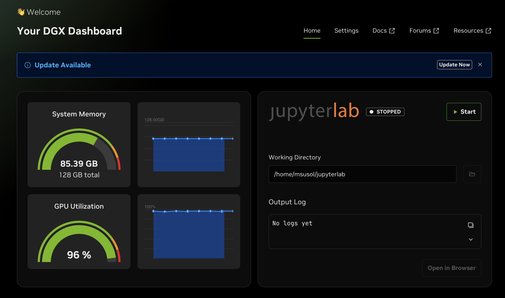
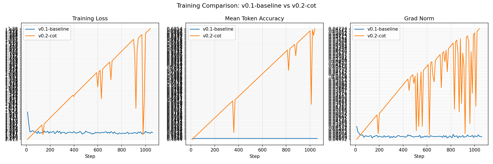
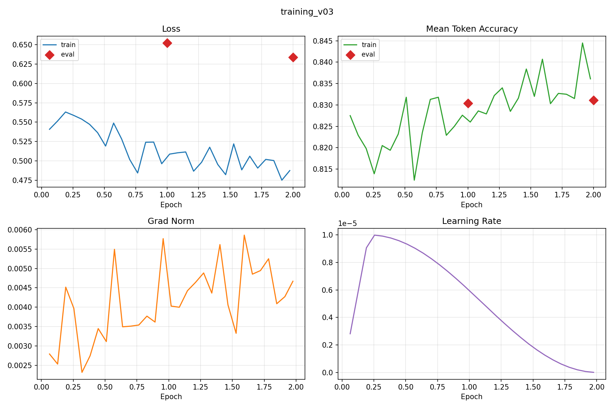

# Nemotron LoRA Training on GB10 for the Kaggle Reasoning Challenge

https://www.kaggle.com/competitions/nvidia-nemotron-model-reasoning-challenge

This repo contains the full pipeline for training a Nemotron LoRA adapter on a GB10-style NVIDIA system using Hugging Face, PEFT, TRL, and DSPy, then exporting a Kaggle-compatible `submission.zip`.

## Goal

The target competition is the **NVIDIA Nemotron Model Reasoning Challenge** on Kaggle. The required submission is a LoRA adapter for **Nemotron-3-Nano-30B** with rank at most 32, evaluated under vLLM with deterministic generation settings and a metric that prefers answers inside `\\boxed{}`.

## Hardware

Training runs on a **NVIDIA DGX Spark (GB10)** — 128 GB unified CPU/GPU memory, Blackwell GB10 GPU, aarch64.



## Repository layout

```text
.
├── .env                         # not tracked — HF_TOKEN, KAGGLE_API_TOKEN go here
├── .gitignore
├── CLAUDE.md
├── README.md
├── Dockerfile.gb10                      # primary build (26.04-py3)
├── Dockerfile.gb10-26-01                # validated 26.01-py3 baseline (used for training)
├── Dockerfile.gb10-25-12                # archived 25.12-py3 baseline
├── Dockerfile.vllm-gb10                 # vLLM serving image — CoT generation + GRPO inference
├── .clinerules/                         # 17 rules (framework 01-12, project-specific 13-17)
├── configs/
│   └── nemotron.yaml                # training hyperparameters
├── data/                            # versioned datasets
│   ├── v0.1_train.jsonl     # 9,500 examples — raw competition data (prompt + \boxed{answer})
│   ├── v0.1_train.csv       # original competition CSV (reconstructed from kagglehub cache)
│   ├── v0.3_train.jsonl     # 2,510 examples — correctness-filtered CoT (kishanvavdara)
│   ├── v0.3_valid.jsonl     # 279 examples — correctness-filtered CoT validation
│   └── v0.3_valid_labels.jsonl  # {"id","answer"} pairs for validate_metric.py
├── docs/
│   ├── images/
│   │   ├── dgx-spark-dashboard.png         # DGX Spark CPU/GPU usage during training
│   │   ├── training_comparison_v01_v02.png # v0.1 vs v0.2 training curves
│   │   └── training_v03.png                # v0.3 training curves
│   ├── investigate/
│   │   ├── dataset-comparison.md        # raw competition data vs peer CoT dataset
│   │   ├── v0.3-training-analysis.md    # v0.3 training metrics and analysis
│   │   └── huikang-pipeline.md          # 0.85 corpus investigation — solvers, Tinker, test categories
│   └── plans/
│       ├── TODO.md                      # central task checklist
│       ├── leaderboard.md               # run history and scores
│       ├── v0.3-cot-filtered-plan.md    # v0.3 plan (complete — Kaggle 0.50)
│       ├── v0.4-blended-plan.md         # v0.4 plan — huikang corpus SFT (seq=8192)
│       ├── v0.5-grpo-plan.md            # v0.5 plan — GRPO self-improvement
│       ├── implementation-plan.md
│       ├── competition-overview.md
│       ├── CITATIONS.md
│       └── ...                          # other plan files
├── notebook/
│   ├── kaggle_prize_eligibility_outline.ipynb   # public prize eligibility writeup
│   ├── kernel-metadata.json                     # push config for prize notebook
│   ├── nemotron_submission_demo.ipynb           # submission path 2: load adapter → /kaggle/working
│   ├── submission-demo-kernel-metadata.json     # push config for submission demo
│   └── scrapbook.ipynb
└── scripts/
    ├── build_image.sh               # builds Docker image (26.01 used for training)
    ├── load_config.sh               # exports configs/nemotron.yaml as env vars
    ├── download_data.py             # competition data download + JSONL conversion
    ├── download_peer_cot.py         # peer CoT dataset download + JSONL conversion
    ├── smoke_test_nemotron.py
    ├── train_lora.py
    ├── infer_lora.py                # run inference with a saved adapter
    ├── validate_metric.py           # score predictions against labels
    ├── plot_training.py
    ├── package_submission.sh        # zip adapter into submission.zip
    ├── analyze_by_type.py           # per-type accuracy breakdown from scored predictions
    ├── blend_datasets.py            # blend versioned data files into a training set
    ├── generate_synthetic_cot.py    # call vLLM API to generate + verify CoT for gap problems
    ├── reconstruct_v0.1_data.py     # rebuild v0.1 JSONL from competition CSV cache
    ├── run_download.sh              # runner: competition data
    ├── run_download_peer_cot.sh     # runner: peer CoT dataset
    ├── run_smoke_test.sh
    ├── run_train.sh                 # runner: training (reads configs/nemotron.yaml)
    ├── run_inference.sh
    ├── run_validate.sh
    └── run_vllm.sh                  # start vLLM OpenAI-compatible server (nemotron-vllm-gb10)
```

## Commands

### 1. Build the image

```bash
bash scripts/build_image.sh
```

**GB10 / aarch64**: Always build directly on the GB10 — never import an image built on x86\_64.
The `causal_conv1d` and `mamba_ssm` CUDA extensions must be compiled for `aarch64 + sm_120`.

**`selective_scan_cuda` / mamba-ssm note**: Docker OCI workers have isolated device namespaces;
GPU devices are not accessible during `docker build` on this system (confirmed: privileged
buildkitd daemons, `[worker.oci] privileged=true`, and TCP remote builders were all attempted).
`selective_scan_cuda` therefore cannot compile at build time and is patched with `try/except` in
the Dockerfile so mamba-ssm imports cleanly. This is safe: Nemotron-H uses Mamba-2 Triton
kernels exclusively and never calls the legacy `selective_scan_cuda` path.

To force a full recompile of the mamba/causal-conv1d layers (e.g., after a base-image update):

```bash
bash scripts/build_image.sh "" --fresh
```

Archived baselines:
- 26.01: `bash scripts/build_image.sh 26-01`
- 25.12: `bash scripts/build_image.sh 25-12`

**OOM note**: CUDA extension compilation is memory-intensive. Both Dockerfiles cap parallel
jobs at `MAX_JOBS=8` for `pip install --no-binary` steps and `-j8` for the bitsandbytes cmake
build (previously `-j$(nproc)` = 72 jobs on Grace, which OOM'd the DGX Spark).

### 2. Training data

`data/v0.3_train.jsonl` (2,510 ex) and `data/v0.1_train.jsonl` (9,500 ex) are committed.
For **v0.4**, the training data is the `samvalladares/huikang-nemotron-artifacts` corpus —
15,979 problems with exhaustive algorithmic CoT traces covering both the training set and the
test set (which has 8+ problem categories not present in `train.csv`). See
[`docs/investigate/huikang-pipeline.md`](docs/investigate/huikang-pipeline.md) for a full
analysis of the corpus and why it achieves 0.85.

To build the v0.4 training data, download the corpus and run the extraction script:

```bash
kaggle datasets download samvalladares/huikang-nemotron-artifacts \
  --path .cache/huikang-artifacts/

python scripts/extract_huikang_corpus.py \
  --zip .cache/huikang-artifacts/huikang-nemotron-artifacts.zip \
  --out-train data/v0.4_train.jsonl \
  --out-valid data/v0.4_valid.jsonl
```

To regenerate prior data versions, add `KAGGLE_USERNAME` and `KAGGLE_API_TOKEN` to `.env`:

```bash
bash scripts/run_download_peer_cot.sh   # v0.2/v0.3 — kishanvavdara CoT dataset
bash scripts/run_download.sh            # v0.1 — raw competition labels
```

### 3. Run the smoke test

```bash
bash scripts/run_smoke_test.sh
```

**Expected timing**:
- First run (weights not yet cached): ~8–10 min model download + ~30 s shard load + ~5–15 min
  Triton JIT kernel compilation before the first token appears.
- Subsequent runs (weights cached in `~/.cache/huggingface`): ~30 s shard load + ~5–15 min
  Triton JIT, then generation completes quickly.

**Expected output** (abridged):

```text
Loading tokenizer: nvidia/NVIDIA-Nemotron-3-Nano-30B-A3B-BF16
Loading model: ...
Loading checkpoint shards: 100%|██████████| 13/13
=== SAMPLE GENERATION ===
... 17 + 25 = 42 ... Final answer: \boxed{42}
Saved PEFT smoke adapter to: /workspace/output/smoke_adapter
```

After the run, `output/smoke_adapter/adapter_config.json` must exist — that confirms the full
tokenizer → model load → generation → PEFT export stack works end-to-end.

**Memory note**: `smoke_test_nemotron.py` passes `max_memory={0: "115GiB"}` to `from_pretrained`,
keeping all shards on the GB10's unified GPU memory and preventing `device_map="auto"` from
spilling to NVMe (disk offload makes generation take 60+ minutes). Adjust the cap if running
on a system with less GPU memory.

### 4. LoRA training run

Edit `configs/nemotron.yaml` to set hyperparameters, then:

```bash
# Basic run — outputs timestamped log and adapter dir
bash scripts/run_train.sh

# Named run — log and adapter dir include RUN_NAME prefix (recommended)
RUN_NAME=cot_v1 bash scripts/run_train.sh
# → output/train_cot_v1_YYYYMMDD_HHMMSS.log
# → output/adapter_cot_v1_YYYYMMDD_HHMMSS/
```

The script reads all hyperparameters from `configs/nemotron.yaml` via `load_config.sh`.

### 5. Validate

After training, run inference on the validation set and score it:

```bash
bash scripts/run_validate.sh
```

Or to score a specific predictions file:

```bash
bash scripts/run_validate.sh --predictions output/predictions_cot_v1.jsonl
```

### 6. Package adapter into `submission.zip`

```bash
bash scripts/package_submission.sh output/adapter_cot_vX_YYYYMMDD_HHMMSS output/submission
# → output/submission/submission.zip
```

### 7. Submit to Kaggle

```bash
source .env && kaggle competitions submit \
  -c nvidia-nemotron-model-reasoning-challenge \
  -f output/submission/submission.zip \
  -m "v0.4 huikang corpus lr=2e-4 seq=8192"
```

### Kaggle Notebooks

| Notebook | URL | Purpose |
|---|---|---|
| Prize eligibility writeup | [nemotron-3-nano-30b-lora-reasoning-challenge](https://www.kaggle.com/code/gdataranger/nemotron-3-nano-30b-lora-reasoning-challenge) | Public writeup required for prizes |
| Submission demo | [nemotron-lora-submission-demo](https://www.kaggle.com/code/gdataranger/nemotron-lora-submission-demo) | Loads pre-trained adapter → saves to `/kaggle/working` for submission |

To push notebook updates:

```bash
# Prize eligibility notebook
source .env && KAGGLE_KEY="${KAGGLE_API_TOKEN}" kaggle kernels push -p notebook/

# Submission demo
cp notebook/nemotron_submission_demo.ipynb /tmp/demo-push/
cp notebook/submission-demo-kernel-metadata.json /tmp/demo-push/kernel-metadata.json
source .env && KAGGLE_KEY="${KAGGLE_API_TOKEN}" kaggle kernels push -p /tmp/demo-push/
```

### Leaderboard

See [`docs/plans/leaderboard.md`](docs/plans/leaderboard.md) for the full run history.

| Version | Data | Val Acc | Kaggle Score |
|---|---|---|---|
| v0.1-baseline | Competition labels only | 43.5% (413/950) | 0.57 |
| v0.2-cot | Peer CoT (Gemini-2.0-flash, noisy) | 30.7% (285/929) | 0.54 — regression |
| v0.3-filtered | Correctness-filtered CoT (kishanvavdara) | pending | 0.50 — regression; test set has 14 categories, training covered only 6 |
| v0.4-huikang | Huikang corpus — 15,979 problems incl. test set, seq=8192 | pending | pending |


