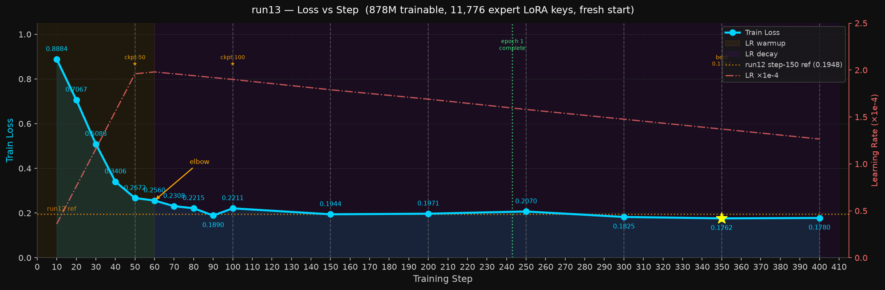

# Nemotron LoRA Training on GB10 for the Kaggle Reasoning Challenge

https://www.kaggle.com/competitions/nvidia-nemotron-model-reasoning-challenge

Full pipeline for training a Nemotron-3-Nano-30B LoRA adapter on a DGX Spark GB10, then packaging a Kaggle-compatible `submission.zip` with per-expert MoE LoRA keys.

## Methodology

This project applies the **vibe planning** methodology to competitive ML — using Claude Code
as an active collaborator throughout research, debugging, and implementation rather than as a
code generator. Demonstrated in
[msusol/vibe-planning-dgx-spark-demo](https://github.com/msusol/vibe-planning-dgx-spark-demo).

## Goal

The **NVIDIA Nemotron Model Reasoning Challenge** on Kaggle. Submit a LoRA adapter (rank ≤ 32)
for Nemotron-3-Nano-30B, scored by answer accuracy across 14 problem categories.

### Evaluator constraints

The competition uses **standard PEFT + vLLM** at inference:

| Constraint | Value | Implication |
|---|---|---|
| `max_model_len` | 4096 tokens | Train on examples ≤ 4096 tokens |
| `max_tokens` | 3584 tokens | Thinking chain + `\boxed{answer}` must fit |
| `enable_thinking` | True | Chat template must use thinking mode |
| `max_lora_rank` | 32 | Matches our LoRA config |
| Answer extraction | Last `\boxed{...}` | Training data must end with `\boxed{answer}` |

## Hardware

**NVIDIA DGX Spark (GB10)** — 130.7 GB HBM, Blackwell, aarch64.


## Training — The DGX Spark Story

### The expert LoRA problem

NemotronH is a hybrid MoE model. Unsloth injects MoE expert LoRA using a fused kernel format
(`experts.w1/w2/w3` keys) incompatible with Kaggle's standard PEFT evaluator. Early Kaggle
notebook runs (run1–run7) trained expert LoRA locally but submitted only attention adapters
(27M params); the 856M expert params were silently discarded. Scores plateaued at 0.53–0.57.

**Solution**: inject per-expert LoRA in PEFT-compatible format
(`mixer.experts.{j}.up_proj.lora_A.weight` — 11,776 keys total) and convert
`expert_lora_weights.pt` before packaging. Only the DGX Spark GB10 can do this without
Unsloth's fused kernels.

### v0.9 run13 — first valid end-to-end run (complete)

1000 steps · seq=2048 · lr=2e-4 · 878M trainable params · 25h total

| Step | Train Loss | Kaggle Score | Notes |
|---|---|---|---|
| 100 | 0.2211 | 0.45 | Expert LoRA undertrained at step 100 |
| 500 | 0.1864 | **0.58** ★ | Epoch 2 boundary — best overall |
| 600 | 0.1702 | 0.55 | Mid-epoch oscillation |
| 700 | 0.1380 | 0.57 | Epoch 3 boundary recovers |
| 800 | 0.1265 | pending | Best checkpoint train loss |
| 1000 | 0.1220 | pending | Final; submitted 2026-06-13 |

**Key finding**: epoch-boundary checkpoints generalize better than mid-epoch despite lower
train loss. Mild overfit after step 500 — cured by v0.12's fresh data distribution.



### v0.12 run14 — augmented data, warmstart from run13 (active)

600 steps · seq=4096 · lr=1e-4 · warmstart: run13 step-1000 (878M params)

Data: 25,500 rows — 13,730 v0.9 base + 11,770 augmented examples for under-represented
categories (generated from `huikang/huikang-nemotron-repository-snapshot` augmenters/reasoners).
After seq=4096 filtering: 15,502 examples used.

The warmstart inherits run13's fully-trained 856M expert LoRA params. v0.12 uses a richer
distribution to escape run13's mild overfit while preserving the learned reasoning format.

See [`docs/plans/v0.12-reasoner-data-spark-sft.md`](docs/plans/v0.12-reasoner-data-spark-sft.md)
for the full training journey narrative.

## Repository layout

```text
.
├── .env                            # not tracked — HF_TOKEN, KAGGLE_API_TOKEN
├── CLAUDE.md                       # clinerules index
├── data/
│   ├── train.csv                   # competition labels (9,500 problems, 6 categories)
│   ├── test.csv                    # competition test prompts (held-out)
│   ├── v0.9_train.jsonl            # 13,730 examples — Format 4, 14 categories (gitignored)
│   ├── v0.12_train.jsonl           # 25,500 examples — v0.9 + augmented (gitignored)
│   └── v0.12_augmented.jsonl       # 11,770 net-new augmented examples (gitignored)
├── docs/
│   ├── images/
│   │   ├── dgx-spark-dashboard.png
│   │   └── run13_loss_curve.png    # run13 full 1000-step loss curve
│   ├── investigate/                # root cause analyses, ADRs
│   └── plans/
│       ├── leaderboard.md          # full run history and Kaggle scores
│       ├── v0.12-reasoner-data-spark-sft.md  # current plan — training journey + v0.12
│       └── TODO.md
├── output/
│   ├── adapter_v9_run13_ckpt/      # run13 final checkpoint (warmstart for v0.12)
│   └── adapter_v12_spark_ckpt/     # run14 rolling checkpoint (updated every 100 steps)
└── scripts/
    ├── train_v9_sft.py             # SFT trainer — warmstart, per-expert LoRA, expert_lora_weights.pt
    ├── run_train_v9.sh             # Docker runner for v0.9 runs
    ├── run_train_v12.sh            # Docker runner for v0.12 run14
    ├── package_submission.sh       # convert expert_lora_weights.pt → 11,776 PEFT keys + zip
    ├── generate_reasoner_data.py   # generate augmented examples from huikang reasoners
    ├── prepare_v09_data.py         # build v0.9_train.jsonl (Format 4, 14 categories)
    └── services.sh                 # pause/resume non-training containers
```

## Commands

### Train (v0.12 run14 — active)

```zsh
# Always in tmux — never run directly
tmux new -s train_v12
RUN_NAME=v12_spark \
TRAIN_FILE=data/v0.12_train.jsonl \
WARMSTART_ADAPTER=output/adapter_v9_run13_ckpt \
MAX_SEQ_LENGTH=4096 \
MAX_STEPS=600 \
LEARNING_RATE=1e-4 \
bash scripts/run_train_v12.sh
```

Verify warmstart in log: `[moe-lora] Warmstart: loaded 92 expert LoRA weights`  
Monitor: `tail -f output/train_v12_spark.log`

### Package and submit

```zsh
# Package from rolling checkpoint (run on HOST, not inside Docker)
bash scripts/package_submission.sh \
  output/adapter_v12_spark_ckpt \
  /tmp/sub_v12_step<N>

# Submit
kaggle competitions submit \
  -c nvidia-nemotron-model-reasoning-challenge \
  -f /tmp/sub_v12_step<N>/submission.zip \
  -m "v0.12 step-<N>: 878M warmstart run13, 25500 rows augmented"
```

Package from the **rolling copy** (`output/adapter_v12_spark_ckpt`) immediately after each
checkpoint notification — it's overwritten every 100 steps.

### Regenerate v0.12 training data

```zsh
# Generate augmented examples from huikang reasoners/augmenters
python scripts/generate_reasoner_data.py \
  --repo-root /tmp/huikang-repo/nemotron-master \
  --existing  data/v0.9_train.jsonl \
  --out       data/v0.12_augmented.jsonl
```

### Build Docker image

```zsh
bash scripts/build_image.sh
```

Always build on the GB10 directly — never import an x86_64 image. The `causal_conv1d` and
`mamba_ssm` CUDA extensions must be compiled for `aarch64 + sm_120`.

## Leaderboard

See [`docs/plans/leaderboard.md`](docs/plans/leaderboard.md) for the full run history.

| Version | Kaggle Score | Notes |
|---|---|---|
| v0.9-run13-step500 | **0.58** ★ | First valid per-expert LoRA submission — best overall |
| v0.9-run13-step700 | 0.57 | Epoch 3 boundary |
| v0.9-run13-step600 | 0.55 | Mid-epoch oscillation |
| v0.9-run13-step100 | 0.45 | Expert LoRA undertrained |
| v0.9-run13-step800 | pending | Best train-loss checkpoint |
| v0.9-run13-step1000 | pending | Final checkpoint |
| v0.12-run14 | — | Active — ~23h remaining |
