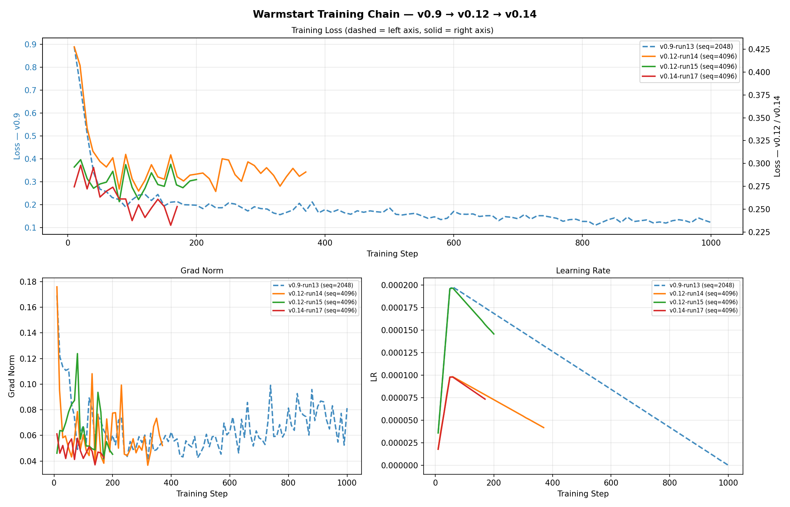

# Nemotron LoRA Training on GB10 for the Kaggle Reasoning Challenge

https://www.kaggle.com/competitions/nvidia-nemotron-model-reasoning-challenge

Full pipeline for training a Nemotron-3-Nano-30B LoRA adapter on a DGX Spark GB10, then packaging a Kaggle-compatible `submission.zip` with per-expert MoE LoRA keys.

## Methodology

This project applies the **vibe planning** methodology to competitive ML — using Claude Code
as an active collaborator throughout research, debugging, and implementation rather than as a
code generator. Demonstrated in
[msusol/vibe-planning-dgx-spark-demo](https://github.com/msusol/vibe-planning-dgx-spark-demo).

## Goal

The **NVIDIA Nemotron Model Reasoning Challenge** on Kaggle. Submit a LoRA adapter (rank ≤ 32)
for Nemotron-3-Nano-30B, scored by answer accuracy across 14 problem categories.

### Evaluator constraints

The competition uses **standard PEFT + vLLM** at inference:

| Constraint | Value | Implication |
|---|---|---|
| `max_model_len` | 4096 tokens | Train on examples ≤ 4096 tokens |
| `max_tokens` | 3584 tokens | Thinking chain + `\boxed{answer}` must fit |
| `enable_thinking` | True | Chat template must use thinking mode |
| `max_lora_rank` | 32 | Matches our LoRA config |
| Answer extraction | Last `\boxed{...}` | Training data must end with `\boxed{answer}` |

## Hardware

**NVIDIA DGX Spark (GB10)** — 130.7 GB HBM, Blackwell, aarch64.


## Training — The DGX Spark Story

### The expert LoRA problem

NemotronH is a hybrid MoE model. Unsloth injects MoE expert LoRA using a fused kernel format
(`experts.w1/w2/w3` keys) incompatible with Kaggle's standard PEFT evaluator. Early Kaggle
notebook runs (run1–run7) trained expert LoRA locally but submitted only attention adapters
(27M params); the 856M expert params were silently discarded. Scores plateaued at 0.53–0.57.

**Solution**: inject per-expert LoRA in PEFT-compatible format
(`mixer.experts.{j}.up_proj.lora_A.weight` — 11,776 keys total) and convert
`expert_lora_weights.pt` before packaging. Only the DGX Spark GB10 can do this without
Unsloth's fused kernels.

### v0.9 run13 — first valid end-to-end run (complete)

1000 steps · seq=2048 · lr=2e-4 · 878M trainable params · 25h total

| Step | Train Loss | Kaggle Score | Notes |
|---|---|---|---|
| 100 | 0.2211 | 0.45 | Expert LoRA undertrained at step 100 |
| 500 | 0.1864 | **0.58** | Epoch 2 boundary — best run13 checkpoint |
| 600 | 0.1702 | 0.55 | Mid-epoch oscillation |
| 700 | 0.1380 | 0.57 | Epoch 3 boundary recovers |
| 1000 | 0.1220 | 0.49 | Final — overfit past step-500 |

**Key finding**: model overfit on 4 epochs of v0.9 data (seq=2048). Cured by v0.12's broader
augmented distribution.

### v0.12 run14 — augmented data, warmstart from run13 (complete)

300 steps (stopped early) · seq=4096 · lr=1e-4 · warmstart: run13 step-1000 · **0.64 ★ new best**

Data: 25,500 rows — 13,730 v0.9 base + 11,770 augmented examples for under-represented
categories. After seq=4096 filtering: 15,502 examples used.

Loss plateaued at 0.285 from step 80 (LR=1e-4 too conservative for a deeply-converged warmstart).
Stopped at step 300 and submitted — scored **0.64**, +0.06 vs run13 best. Confirms v0.12 augmented
data at seq=4096 is the better training distribution.

### v0.12 run15 — higher LR warmstart from run14 (complete)

200 steps · seq=4096 · lr=2e-4 · warmstart: run14 step-300 · stopped at step 200

LR raised from 1e-4 → 2e-4 with fresh Adam state. Loss plateau ~0.273–0.299 from step 50 onward
with no clear downward trend. Submitted step100 and step200 checkpoints; stopped at step200 to
preserve GPU time for run16 on corrected v0.13 data.

### v0.13 run16 — skipped after step 17

run16 started on v0.13 data (11,300 examples, 13/16 categories) but was stopped at step 17.
Root cause: v0.13 completely omits `spelling`, `equation_numeric_deduce`, and `equation_numeric_guess`
— every huikang trace for these categories exceeds 4,096 tokens (medians: 4,884 / 5,874 / 6,148).
With 2 days to deadline, 19 hours on a dataset missing 3 test categories was not worth it.

See [`docs/plans/v0.13-balanced-data-plan.md`](docs/plans/v0.13-balanced-data-plan.md) for the
full dataset build pipeline and risk analysis.

### v0.14 run17 — all 16 categories, warmstart from run15-step200 (active)

500 steps · seq=4096 · lr=1e-4 · warmstart: run15 step-200

**v0.14 dataset** (12,800 examples, all 16 categories): adds short synthetic traces for the 3
categories absent from v0.13. All huikang traces for these cats exceed 4,096 tokens; synthetic
generators produce ≤ 500-token CoT traces in Format 4.

| Category | Count | Natural | Notes |
|---|---|---|---|
| cipher, gravity, matching, numeral, splitting, unit_conversion | 1,500 each | varied | capped |
| equation_symbolic | 500 | 500 | synthetic rule-inference puzzles |
| spelling | 500 | 500 | **new** synthetic ~150 tok — concat words → –char–by–char– |
| equation_numeric_deduce | 500 | 500 | **new** synthetic ~300 tok — operator→{add, abs\_diff} |
| equation_numeric_guess | 500 | 500 | **new** synthetic ~350 tok — operator→{add, abs\_diff, concat} |
| bit_manipulation | 300 | **28** | repeated 10.7× — 99% of huikang traces > 4,096 tok |
| concatenation, cryptarithm_*, equation_numeric, lstrip | 300 each | 85–300 | repeated |

See [`docs/plans/v0.14-capped-data-plan.md`](docs/plans/v0.14-capped-data-plan.md) for the
full dataset build pipeline, drop analysis, and run17 parameters.

*Plot updated at each 100-step checkpoint through run17 completion (step 500).*



## Repository layout

```text
.
├── .env                            # not tracked — HF_TOKEN, KAGGLE_API_TOKEN
├── CLAUDE.md                       # clinerules index
├── data/
│   ├── train.csv                   # competition labels (9,500 problems, 6 categories)
│   ├── test.csv                    # competition test prompts (held-out)
│   ├── v0.9_train.jsonl            # 13,730 examples — Format 4, 16 categories (gitignored)
│   ├── v0.12_train.jsonl           # 25,500 examples — v0.9 + augmented (gitignored)
│   ├── v0.12_augmented.jsonl       # 11,770 net-new augmented examples (gitignored)
│   ├── v0.13_merged.jsonl          # v0.12 + 500 synthetic eq_symbolic (gitignored)
│   ├── v0.13_train.jsonl           # 11,300 examples — token-filtered, 13/16 cats (gitignored)
│   ├── v0.14_merged.jsonl          # v0.12 + 4 synthetic generators, 27,500 rows (gitignored)
│   ├── v0.14_train.jsonl           # 12,800 examples — token-filtered, all 16 cats (gitignored)
│   ├── v09-training-data/          # Kaggle dataset metadata → gdataranger/nemotron-v09-training-data
│   ├── v012-training-data/         # Kaggle dataset metadata → gdataranger/nemotron-v012-training-data
│   ├── v013-training-data/         # Kaggle dataset metadata → gdataranger/nemotron-v013-training-data
│   └── v014-training-data/         # Kaggle dataset metadata → gdataranger/nemotron-v014-training-data
├── docs/
│   ├── images/
│   │   ├── dgx-spark-dashboard.png
│   │   └── training_warmstart_chain.png  # v0.9→v0.12→v0.14 loss curve
│   ├── investigate/                # root cause analyses, ADRs
│   └── plans/
│       ├── leaderboard.md          # full run history and Kaggle scores
│       ├── v0.12-reasoner-data-spark-sft.md  # v0.12 training journey
│       ├── v0.13-balanced-data-plan.md       # v0.13 dataset build (13/16 cats — run16 skipped)
│       ├── v0.14-capped-data-plan.md         # v0.14 dataset build + run17 (all 16 cats)
│       └── TODO.md
├── output/
│   ├── adapter_v9_run13_ckpt/      # run13 final checkpoint
│   ├── adapter_v12_spark_ckpt/     # run14 step-300 checkpoint (0.64 — warmstart for run15)
│   ├── adapter_v12_run15_step200/  # run15 step-200 snapshot (warmstart for run17)
│   └── adapter_v14_run17_ckpt/     # run17 rolling checkpoint (active — every 100 steps)
└── scripts/
    ├── train_v9_sft.py             # SFT trainer — warmstart, per-expert LoRA, expert_lora_weights.pt
    ├── run_train_v9.sh             # Docker runner for v0.9 runs
    ├── run_train_v12.sh            # Docker runner for v0.12 runs
    ├── run_train_v13.sh            # Docker runner for v0.13/run16 (stopped step 17)
    ├── run_train_v14.sh            # Docker runner for v0.14/run17 (active)
    ├── package_submission.sh       # convert expert_lora_weights.pt → 11,776 PEFT keys + zip
    ├── generate_reasoner_data.py   # generate augmented examples from huikang reasoners
    ├── generate_equation_symbolic.py     # synthetic equation_symbolic rule-inference puzzles
    ├── generate_spelling.py              # synthetic spelling puzzles — concat + EN DASH rule
    ├── generate_equation_numeric_deduce.py  # synthetic eq_num_deduce — {add, abs_diff}
    ├── generate_equation_numeric_guess.py   # synthetic eq_num_guess — {add, abs_diff, concat}
    ├── generate_v14_data.sh        # end-to-end v0.14 build: generate → merge → filter → cap
    ├── balance_dataset.py          # token-filter + cap/repeat balancing (--max-tokens flag)
    ├── prepare_v09_data.py         # build v0.9_train.jsonl (Format 4, 16 categories)
    └── services.sh                 # pause/resume non-training containers
```

## Commands

### Train (run17 — active)

```zsh
# Always in tmux — never run directly
tmux new -s train_v14
WARMSTART_ADAPTER=output/adapter_v12_run15_step200 \
RUN_NAME=v14_run17 \
bash scripts/run_train_v14.sh
```

Verify warmstart in log: `[moe-lora] Warmstart: loaded 92 expert LoRA weights`  
Monitor: `tail -f output/train_v14_run17.log`

### Package and submit

```zsh
# Package from rolling checkpoint (run on HOST, not inside Docker)
bash scripts/package_submission.sh \
  output/adapter_v14_run17_ckpt \
  /tmp/sub_v14_step<N>

# Submit
kaggle competitions submit \
  -c nvidia-nemotron-model-reasoning-challenge \
  -f /tmp/sub_v14_step<N>/submission.zip \
  -m "v0.14 run17 step-<N>: all 16 cats, warmstart run15-step200"
```

Package from the **rolling copy** (`output/adapter_v14_run17_ckpt`) immediately after each
checkpoint notification — it's overwritten every 100 steps.

### Regenerate v0.12 training data

```zsh
# Generate augmented examples from huikang reasoners/augmenters
python scripts/generate_reasoner_data.py \
  --repo-root /tmp/huikang-repo/nemotron-master \
  --existing  data/v0.9_train.jsonl \
  --out       data/v0.12_augmented.jsonl
```

### Build Docker image

```zsh
bash scripts/build_image.sh
```

Always build on the GB10 directly — never import an x86_64 image. The `causal_conv1d` and
`mamba_ssm` CUDA extensions must be compiled for `aarch64 + sm_120`.

## Leaderboard

See [`docs/plans/leaderboard.md`](docs/plans/leaderboard.md) for the full run history.

| Version | Seq Len | PEFT Keys | Trainable Params | Train Loss | Kaggle Score | Notes |
|---|---|---|---|---|---|---|
| v0.9-run13-step500 | 2048 | 11,962 (186 base + 11,776 expert) | 878M | 0.1864 | 0.58 | Best run13 checkpoint — epoch 2 boundary |
| v0.9-run13-step700 | 2048 | 11,962 (186 base + 11,776 expert) | 878M | 0.1380 | 0.57 | Epoch 3 boundary |
| v0.9-run13-step1000 | 2048 | 11,962 (186 base + 11,776 expert) | 878M | 0.1220 | 0.49 | Overfit — 4 epochs on v0.9 data |
| v0.12-run14-step300 | 4096 | 11,962 (186 base + 11,776 expert) | 878M | ~0.285 | **0.64 ★** | New best — warmstart run13, v0.12 augmented data |
| v0.12-run15-step100 | 4096 | 11,962 (186 base + 11,776 expert) | 878M | 0.2738 | 0.64 | Warmstart run14, lr=2e-4 — plateau from step 50, no improvement vs run14 |
| v0.12-run15-step200 | 4096 | 11,962 (186 base + 11,776 expert) | 878M | 0.2823 | 0.64 | Run15 final — stopped at step 200; same score as run14 |
| v0.13-run16 | 4096 | 11,962 (186 base + 11,776 expert) | 878M | — | skipped | Stopped step 17 — v0.13 missing 3 of 16 categories; pivoted to v0.14 |
| v0.14-run17 | 4096 | 11,962 (186 base + 11,776 expert) | 878M | — | **active** | Warmstart run15-step200, v0.14 all 16 cats, 12,800 rows; 500 steps planned |
